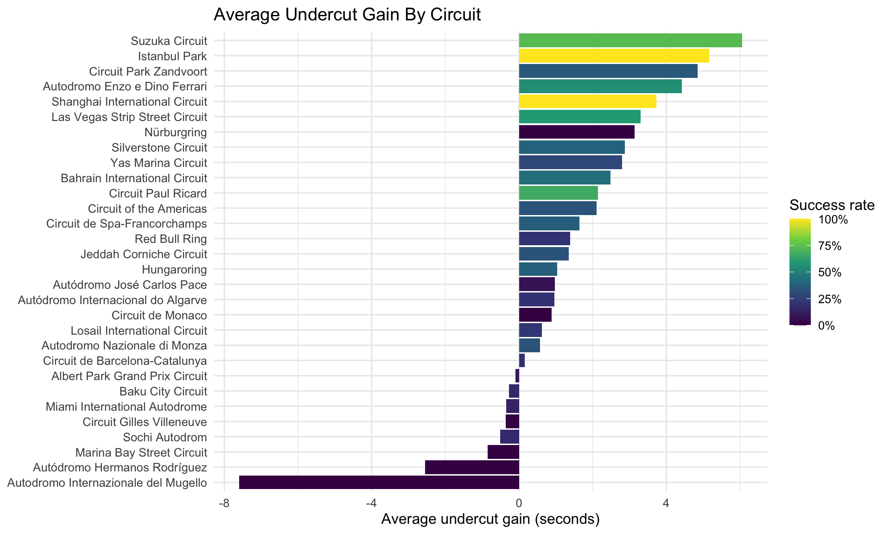
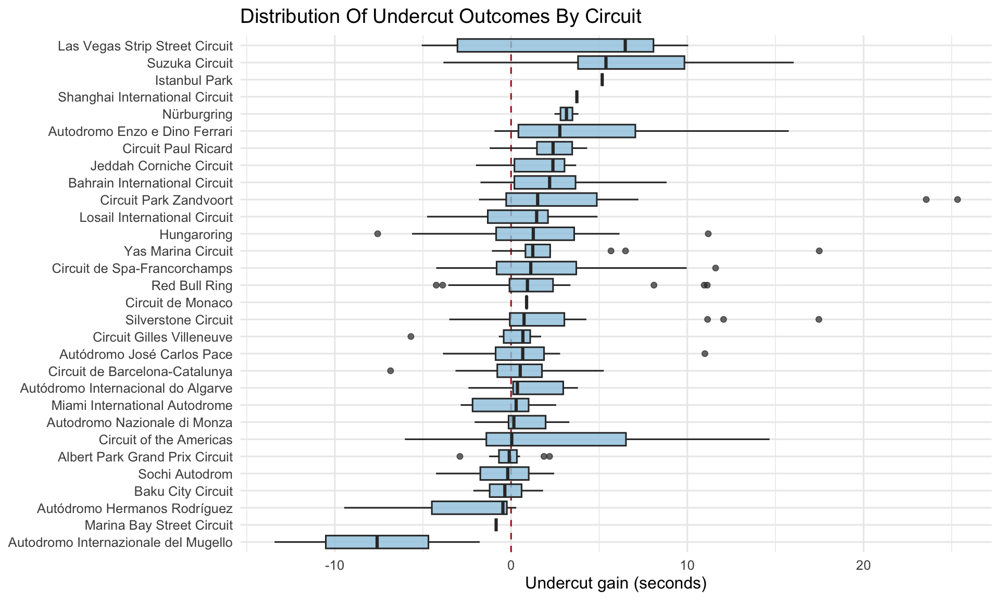
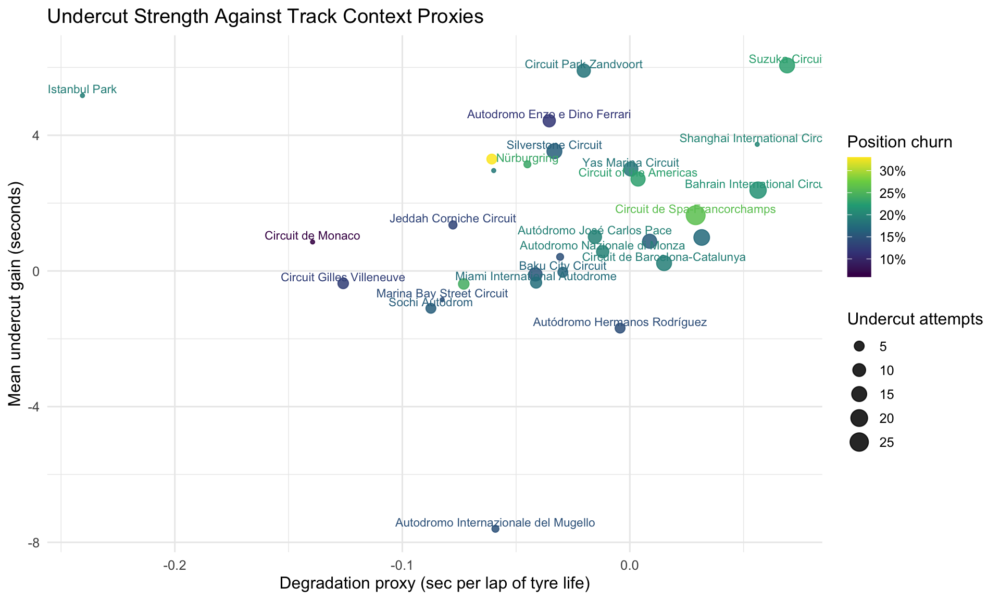

# Formula 1 Undercut / Overcut Analysis

This R project analyzes Formula 1 pit strategy using lap-by-lap timing data from `f1dataR`. The main question is:

> Which circuits most reward the undercut, measured by net time gained after a full pit cycle?

The analysis focuses on clean strategy battles rather than every pit stop. A retained event requires a driver to pit while following a rival, the rival to stop shortly afterward, and both drivers to complete the pit cycle under usable race conditions.

## Why I Built This

Pit strategy is one of the clearest places where timing data turns into competitive value. This project treats an undercut as a measurable process: identify the battle, measure the gap before the first stop, wait until both drivers complete the pit cycle, then measure the net gain or loss. The result is a circuit-level view of where stopping early tends to create value and where staying out can still defend the position.

## What This Measures

The core metric is completed pit-cycle gain:

```text
undercut_gain = gap_before_first_stop - gap_after_both_stops
```

Positive values mean the driver who stopped first gained time through the pit cycle. Negative values mean the delayed stopper defended successfully or gained through an overcut-like outcome.

## Methodology

The pipeline:

- Loads race schedules, lap timing, race results, and driver metadata through `f1dataR`.
- Identifies two-car battles where the pit-first driver was directly behind a rival before stopping.
- Evaluates the gap after both cars have completed their stops and a short settling window has passed.
- Filters out abnormal cases such as retirements, repeat pit stops within two laps, very long service, broken timing windows, and defensive leader stops.
- Summarizes undercut and overcut outcomes by circuit.
- Adds supporting track-context proxies for tyre degradation and position churn.

## Example Results

### Average undercut gain by circuit



### Distribution of undercut outcomes



### Undercut strength and track context



## Scope

The notebook is configured for the 2019-2024 seasons. This gives a broader modern-era sample, but it also spans different regulation contexts. The results should be read as broad strategy evidence, not as a perfectly controlled same-car-era comparison.

The current rendered report uses the races available in the local cache. At the time of this render, that includes the full 2019-2024 window.

## Key Takeaway

The undercut is not equally valuable everywhere. The strongest tracks in this sample are circuits where fresh-tyre performance can be converted quickly after the stop. The weaker tracks are not simply "bad strategy" cases; they often represent situations where traffic, track position, or the delayed stopper's clean air made the overcut-like response more effective.

## Limitations

- The analysis does not claim to identify every strategic intention from teams.
- The track-context variables are proxies, not direct physical measurements.
- Weather, safety cars, traffic, and driver pace can still influence individual events.
- Pit-lane time loss is not shown as a headline variable because the official pit-stop feed reports service duration, not total pit-lane loss.

## Reproducing

Open `undercut_overcut_analysis.Rmd` in RStudio and knit the document.

The notebook expects:

- R with `rmarkdown`, `dplyr`, `ggplot2`, `f1dataR`, `reticulate`, and related tidyverse packages.
- A FastF1-compatible Python environment available through `reticulate`.

The analysis code is written in R. FastF1 is only the timing-data backend that `f1dataR` accesses through `reticulate`. In this workspace, the notebook is configured to use:

```r
Sys.setenv(RETICULATE_PYTHON = "/opt/anaconda3/bin/python3")
```

Race data is cached under `cache/` so reruns are faster after the first full render.
